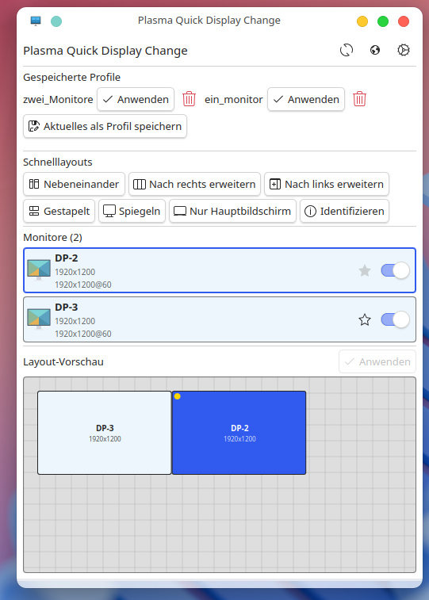
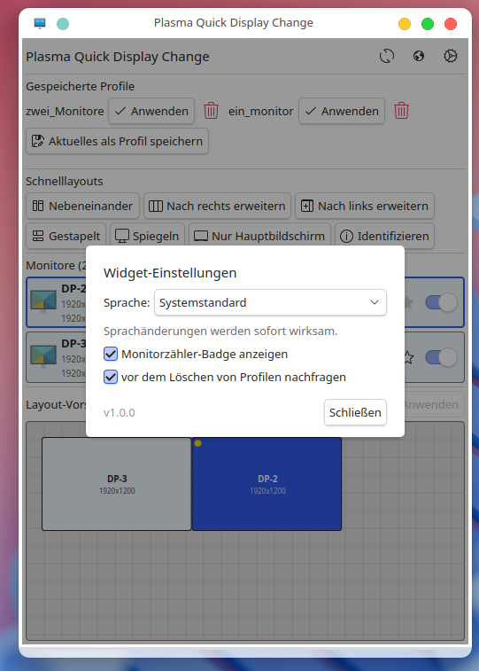

# Plasma Quick Display Change – Standalone

A standalone desktop application for quickly switching and managing monitor configurations on KDE Plasma 6. Runs as a regular window without requiring the Plasma panel.






## Features

- **Saved Profiles** – Save the current monitor configuration as a named profile and restore it with a single click
- **Quick Layouts** – Side by side, extend left/right, stacked, mirrored, primary only
- **Monitor Control** – Enable/disable monitors, set primary display
- **Layout Editor** – Drag & drop preview of monitor positions with snapping
- **Monitor Identification** – Overlay on each monitor showing name and resolution
- **16 Languages** – German, English, Hungarian, French, Spanish, Italian, Portuguese (BR), Russian, Polish, Dutch, Turkish, Japanese, Korean, Chinese (simplified/traditional)
- **Persistent Settings** – Profiles and language are preserved across restarts

## Requirements

- **KDE Plasma 6** (Frameworks & Qt 6)
- **kscreen-doctor** – Part of `libkscreen` / `plasma-workspace`
- **qml6** – QML runtime from Qt 6

### Installing Dependencies

Package names differ by distribution. If a package is not found, try the variant for your distro:

```bash
# Kubuntu / Ubuntu (package may be named libkscreen2-tools or missing on some versions)
sudo apt install qt6-declarative-dev-tools libkscreen2-tools

# Debian (e.g. Trixie/Bookworm) – if libkscreen2-tools is not available:
sudo apt install qml-qt6 libkscreen-bin
# Or: kscreen (often includes kscreen-doctor)
sudo apt install qt6-declarative-dev-tools kscreen

# Arch Linux
sudo pacman -S qt6-declarative libkscreen

# Fedora
sudo dnf install qt6-qtdeclarative-devel kscreen
```

If a package is not found, run `apt search kscreen` or `apt search qml` to find the correct name for your system.

## Installation

**Dependencies must be installed before running the installer.** Otherwise the install script will warn and the application will not run:

- **qml6** (Qt 6 QML runtime)
- **kscreen-doctor** (display control)

See [Installing Dependencies](#installing-dependencies) above for the package commands (apt/pacman/dnf).

---

The application can be installed as a user-level program (no `sudo` required):

```bash
./install.sh
```

The install script:
- Copies application files to `~/.local/share/plasma-quick-display-change/`
- Creates a launcher script in `~/.local/bin/plasma-quick-display-change`
- Installs the application icon to `~/.local/share/icons/hicolor/scalable/apps/`
- Creates a `.desktop` entry in `~/.local/share/applications/` (application menu)
- Checks whether the dependencies (`qml6`, `kscreen-doctor`) are available

After installation the application is available via:
- **Terminal:** `plasma-quick-display-change`
- **Application menu:** Search for "Plasma Quick Display Change"

> **Note:** If `~/.local/bin` is not in your `$PATH`, add this line to `~/.bashrc`:
> ```bash
> export PATH="$HOME/.local/bin:$PATH"
> ```

### Uninstallation

```bash
./uninstall.sh
```

Removes all installed files from `~/.local/` after confirmation. The settings file (`~/.config/Unknown Organization/qml6.conf`) is not removed.

## Running Without Installation

The application can also be started directly without installation:

```bash
./run.sh
```

The script automatically finds `qml6` or `qml` and opens the application as a standalone window. On first launch, the icon and `.desktop` file are automatically copied to `~/.local/` so the window is displayed correctly in the taskbar.

## Usage

1. **View monitors** – On startup all connected monitors are detected and displayed.
2. **Quick Layouts** – Apply predefined arrangements (side by side, extend, mirror, etc.) with a single click.
3. **Save profile** – Click "Save current as profile", enter a name. The profile stores the complete kscreen-doctor JSON configuration.
4. **Load profile** – Restore a saved profile via "Apply".
5. **Layout Editor** – Arrange monitors via drag & drop in the preview, then click "Apply".
6. **Settings** – Via the globe icon: configure language, badge display, delete confirmation.

## Project Structure

```
├── run.sh                                  # Launch script
├── install.sh                              # Installer (to ~/.local/)
├── uninstall.sh                            # Uninstaller
├── plasma-quick-display-change.desktop     # Desktop entry (template)
├── contents/
│   ├── ui/
│   │   ├── main.qml                       # Main window (ApplicationWindow)
│   │   ├── FullRepresentation.qml          # Main UI (profiles, layouts, monitors)
│   │   ├── CommandRunner.qml               # Shell command execution via Plasma DataSource
│   │   ├── Translations.qml               # Translations (16 languages)
│   │   ├── MonitorDelegate.qml            # Single monitor entry in the list
│   │   ├── LayoutEditor.qml               # Drag & drop layout preview
│   │   └── IdentifyWindow.qml             # Monitor identification overlay
│   └── icons/
│       ├── monitors.svg                    # Application icon
│       └── monitor-single.svg             # Single monitor (list icon)
├── .gitignore
└── README.md
```

## Technical Details

- **Detection:** `kscreen-doctor -o` provides the current monitor configuration (text output is parsed).
- **Saving:** `kscreen-doctor -j` provides the full configuration as JSON – stored as a profile.
- **Loading:** A `kscreen-doctor` command is built from the saved JSON (e.g. `output.DP-2.enable output.DP-2.position.0,0 output.DP-2.mode.1`).
- **Command execution:** Via `Plasma5Support.DataSource` with the `executable` engine (works outside the Plasma panel as well).
- **Persistence:** `QtCore.Settings` stores profiles and settings in `~/.config/Unknown Organization/qml6.conf` (standalone mode).
- **Window icon:** Set via `--qwindowicon`. Taskbar association is handled through `StartupWMClass=org.qt-project.qml` in the `.desktop` file, along with `QT_WAYLAND_APP_ID` and `DESKTOP_FILE_HINT` on Wayland.

## Origin

Based on [izll/plasma-quick-display-change](https://github.com/izll/plasma-quick-display-change) (Quick Display Change for Plasma 6, author: izll). Extended with saved display profiles and standalone mode.

## License

GPL-3.0-or-later
